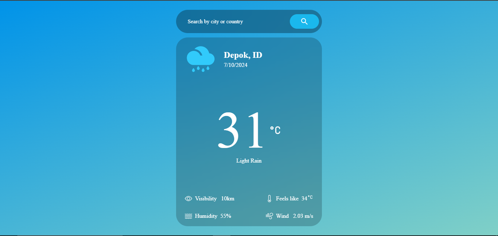

# WeatherNow 🌤️

**WeatherNow** adalah aplikasi web ramalan cuaca yang dirancang dengan antarmuka modern dan intuitif, memudahkan pengguna untuk mengakses informasi cuaca secara cepat dan akurat. Aplikasi ini menampilkan data cuaca real-time berdasarkan kota atau negara yang dicari pengguna, dengan informasi lengkap mengenai suhu, kondisi cuaca, jarak pandang, kelembaban, kecepatan angin, dan suhu yang dirasakan (_feels like_).

## Fitur Utama

- 🔍 **Pencarian Lokasi**: Cari informasi cuaca berdasarkan kota atau negara.
- 🌡️ **Data Cuaca Terperinci**: Menyediakan suhu, kondisi cuaca, jarak pandang, kelembaban, kecepatan angin, dan suhu yang dirasakan.
- 💻 **Antarmuka Responsif**: Desain modern dan responsif yang memastikan pengalaman pengguna optimal di berbagai perangkat.
- 🎨 **Tampilan Minimalis**: Latar belakang gradasi biru yang menyegarkan dengan fokus pada informasi yang mudah diakses.

## Screenshot



## Teknologi yang Digunakan

- ⚛️ **ReactJS**: Library JavaScript untuk membangun antarmuka pengguna.
- 🚀 **Vite**: Alat build yang cepat untuk pengembangan frontend modern.
- 🌍 **OpenWeatherMap API**: API untuk mengambil data cuaca real-time berdasarkan lokasi.

## Cara Menggunakan

1. Clone repository ini ke mesin lokal Anda:
   ```bash
   git clone https://github.com/username/WeatherNow.git
   ```
2. Buka folder proyek:
   ```bash
   cd WeatherNow
   ```
3. Buka `index.html` di browser favorit Anda.

## API

Aplikasi ini menggunakan [OpenWeatherMap API](https://openweathermap.org/api) untuk mengambil data cuaca real-time. Pastikan untuk mendapatkan **API key** Anda dari OpenWeatherMap dan menggantinya di file JavaScript.
